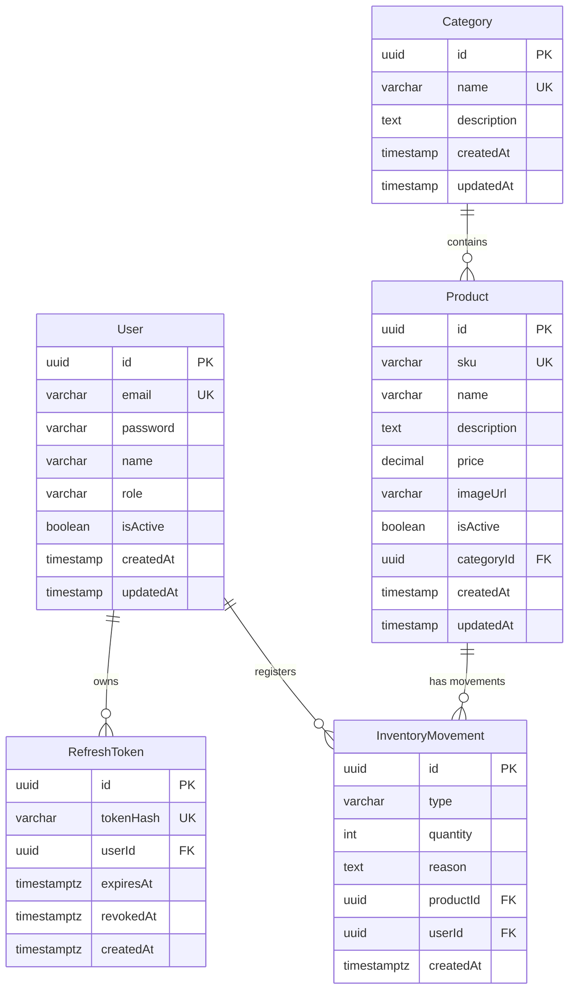
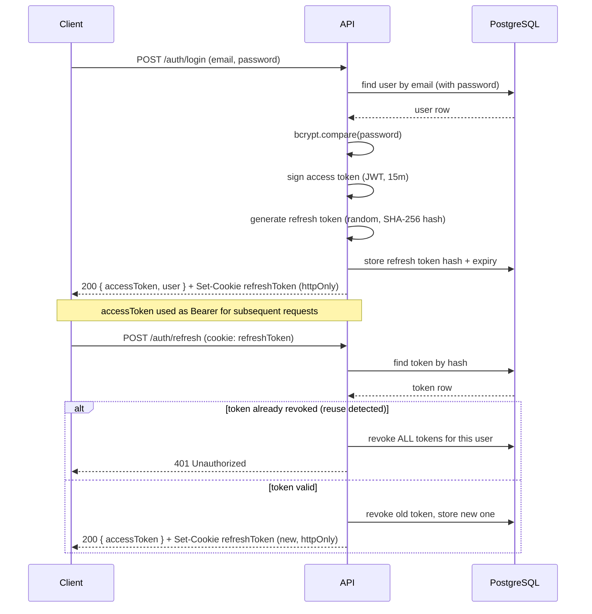
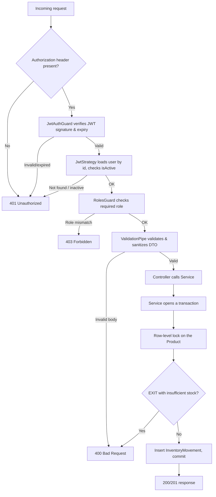

# Inventory API

RESTful API for inventory management with role-based access control, custom JWT authentication (access token + rotating httpOnly refresh token), and full movement-tracking history, built with NestJS and a layered architecture on top of TypeORM.

## Features

- User registration and login with hashed passwords (bcrypt, 12 salt rounds)
- Authentication via short-lived JWT access tokens + a rotating refresh token delivered as an httpOnly cookie
- Refresh token rotation with reuse detection: reusing an already-rotated token revokes every active session for that user (stolen-token mitigation)
- Role-based access control (ADMIN / USER) enforced with guards, plus per-resource identity checks (a user can view/edit their own profile; only the owner can change their own password)
- Full CRUD for products and categories, with soft-delete on products and delete-blocking on categories that still have associated products
- Product filtering by name (partial match), category, and price range, with paginated, deterministically-ordered results
- Inventory movements (ENTRY / EXIT / ADJUSTMENT) with full history, computed stock derived from the movement log (not stored redundantly on the product), and row-level locking to prevent race conditions on concurrent stock updates
- Centralized error handling with a consistent response shape across the whole API
- Interactive API documentation via Swagger, with JWT bearer auth support
- Security headers via Helmet, strict CORS with credentials support, and request size limits
- Fail-fast environment variable validation at boot
- Fully containerized with a multi-stage Dockerfile (non-root runtime user) and Docker Compose orchestration

## Stack

- Runtime: Node.js + NestJS (ES Modules)
- Database: PostgreSQL + TypeORM (versioned migrations, no `synchronize`)
- Authentication: JWT (`@nestjs/jwt`, `passport-jwt`) + bcrypt
- Validation: `class-validator` / `class-transformer`
- Documentation: Swagger (`@nestjs/swagger`)
- Security: Helmet, CORS, cookie-parser
- Testing: Vitest — unit tests (mocked repositories) + end-to-end tests (real Postgres instance)
- Containerization: Docker (multi-stage build) + Docker Compose

## Architecture

Modular, layered architecture: controllers → services → repositories (TypeORM), with cross-cutting concerns (auth guards, roles, exception handling, pagination) factored into a shared `common/` module. Configuration is centralized and validated once at boot, rather than read ad hoc from `process.env` throughout the codebase.

```
inventory-api/
├── src/
│   ├── config/
│   │   ├── env.ts                 # Fail-fast environment variable validation (db + jwt)
│   │   ├── typeorm.config.ts      # TypeORM options for runtime (AppModule)
│   │   ├── data-source.ts         # DataSource for the migrations CLI (dev/test)
│   │   └── data-source.prod.ts    # DataSource for the migrations CLI (prod)
│   │
│   ├── common/
│   │   ├── decorators/            # @Roles, @CurrentUser
│   │   ├── guards/                # JwtAuthGuard, RolesGuard
│   │   ├── filters/                # Global HttpExceptionFilter
│   │   ├── dto/                    # PaginationQueryDto
│   │   ├── enums/                  # Role
│   │   └── utils/                  # Postgres error translation (unique/FK violations)
│   │
│   ├── auth/
│   │   ├── entities/               # RefreshToken
│   │   ├── strategies/             # JwtStrategy
│   │   ├── dto/                    # RegisterDto, LoginDto
│   │   ├── auth.service.ts
│   │   └── auth.controller.ts
│   │
│   ├── users/
│   ├── categories/
│   ├── products/
│   └── inventory/
│       # Each domain module follows the same shape:
│       # entities/, dto/, <module>.service.ts, <module>.controller.ts,
│       # plus *.spec.ts (unit) and *.e2e-spec.ts (end-to-end) alongside the code
│
├── test/
│   └── utils/
│       └── test-app.ts             # Shared e2e bootstrap (test app + DB cleanup + auth helpers)
│
├── Dockerfile                       # Multi-stage build (deps-prod / builder / runtime)
├── docker-compose.yml                # api + postgres + postgres-test (test profile, opt-in)
├── vitest.config.ts                  # Unit tests
├── vitest.config.e2e.ts               # End-to-end tests (sequential execution against real DB)
└── package.json
```

## Database Schema



Design decisions:

- All primary keys are UUIDs to avoid exposing sequential identifiers.
- `price` is `NUMERIC(10,2)`, never `FLOAT`, to avoid rounding errors with money.
- Stock is **not** stored on `Product`. It's derived on read from `InventoryMovement`: the most recent `ADJUSTMENT` acts as a checkpoint, and only `ENTRY`/`EXIT` movements after it are summed. This keeps stock as a single source of truth (the movement log) instead of a redundant column that could drift out of sync.
- `Category` deletion is blocked (`409 Conflict`) if it still has associated products — a real `DELETE`, not a soft-delete, since categories carry no history worth preserving.
- `Product` deletion is a soft-delete (`isActive = false`) — products are referenced by historical `InventoryMovement` rows and should never disappear from that history.
- `RefreshToken.tokenHash` stores a SHA-256 hash of the token, never the plaintext value — the same principle as password hashing, applied to session tokens.
- `RefreshToken.user` cascades on delete (`ON DELETE CASCADE`), since a token is meaningless without its owner.

## Authentication

- **Access token**: JWT signed with `JWT_ACCESS_SECRET`, short TTL (default 15 minutes), payload `{ sub, email, role }`. Returned in the response body and expected on the `Authorization: Bearer <token>` header for protected routes.
- **Refresh token**: an opaque random token (not a JWT), hashed with SHA-256 before being persisted. Delivered as an **httpOnly cookie** (`secure` in production, `sameSite: strict`) — never exposed to client-side JavaScript, and never included in any JSON response.
- **Rotation**: every call to `POST /auth/refresh` revokes the token just used and issues a brand-new pair. The same refresh token can never be redeemed twice.
- **Reuse detection**: if a token that has already been rotated (and is therefore revoked) is presented again, this is treated as a signal of token theft — every refresh token belonging to that user is immediately revoked, forcing re-authentication everywhere.
- Login rejects deactivated accounts (`isActive: false`) with the same generic `401` used for wrong credentials, so failed attempts never leak which emails are registered or which accounts are disabled.
- `POST /auth/logout` revokes the current refresh token and clears the cookie.

## Authorization

Role-based access control (`ADMIN` / `USER`) via `JwtAuthGuard` + `RolesGuard`, with per-resource logic where a role alone isn't enough:

| Resource                      | Read                       | Write                                      |
| ----------------------------- | -------------------------- | ------------------------------------------ |
| Categories                    | Public                     | ADMIN only                                 |
| Products                      | Public                     | ADMIN only                                 |
| Inventory (movements & stock) | ADMIN only                 | ADMIN only                                 |
| Users (list)                  | ADMIN only                 | —                                          |
| Users (single profile)        | ADMIN or the user themself | ADMIN or the user themself                 |
| User password                 | —                          | The user themself only (not even an ADMIN) |

The user who registers an inventory movement is taken from the authenticated request (`@CurrentUser()`), never from the request body.

## Request Flow

**Authentication flow** — how a client obtains and renews access:



**Protected request flow** — how a request to an ADMIN-only endpoint is resolved (e.g. `POST /inventory/movements`):



## Installation

```bash
git clone <repo-url>
cd inventory-api
npm install
cp .env.example .env
```

Fill in `.env`:

```
DB_HOST=localhost
DB_PORT=5432
DB_USER=inventory_user
DB_PASSWORD=inventory_pass
DB_NAME=inventory_db

JWT_ACCESS_SECRET=
JWT_REFRESH_SECRET=
# JWT_ACCESS_EXPIRES_IN=15m
# JWT_REFRESH_EXPIRES_IN=7d
```

Generate strong, distinct secrets for each JWT variable:

```bash
node -e "console.log(require('crypto').randomBytes(32).toString('hex'))"
```

> `JWT_ACCESS_SECRET` and `JWT_REFRESH_SECRET` must be different values — sharing a secret between the two token types would let a leaked refresh token be used to forge access tokens.

## Usage

### With Docker (recommended)

```bash
docker compose up -d
npm run migration:run
```

The API starts on `http://localhost:3000`. Swagger docs are available at `/api/docs` in non-production environments.

### Without Docker

Start a local PostgreSQL instance matching your `.env`, then:

```bash
npm run migration:run
npm run start:dev
```

Verify it's running:

```bash
curl http://localhost:3000/categories
```

Expected response: `[]` (or an array of existing categories).

## Testing

```bash
npm run test        # unit tests (mocked repositories)
npm run test:e2e    # end-to-end tests (requires the test database — see docker-compose.yml)
```

120 tests total: 26 unit tests covering service logic (including transaction and pessimistic-lock behavior on inventory movements, mocked) and 94 end-to-end tests exercising the full HTTP stack against a real PostgreSQL instance — covering CRUD, filtering, pagination, the complete authentication flow (including refresh-token rotation and reuse detection), and the full authorization matrix (public vs. ADMIN-only vs. self-or-ADMIN).

## API Documentation

Full interactive documentation (request/response schemas, example payloads, and a live "Try it out" console) is served via Swagger at `/api/docs` when the API is running outside of production. Every protected endpoint is marked with a bearer-auth lock icon — log in through `POST /auth/login` from the docs UI, then use the "Authorize" button with the returned access token to exercise the rest of the API interactively.

### Endpoints overview

#### Auth

| Method | Route          | Description                                             | Auth required              |
| ------ | -------------- | ------------------------------------------------------- | -------------------------- |
| POST   | /auth/register | Registers a new user                                    | No                         |
| POST   | /auth/login    | Authenticates a user, sets the refresh token cookie     | No                         |
| POST   | /auth/refresh  | Rotates the refresh token and issues a new access token | No (requires valid cookie) |
| POST   | /auth/logout   | Revokes the current refresh token                       | No (requires valid cookie) |

#### Categories

| Method | Route           | Description                                     | Auth required |
| ------ | --------------- | ----------------------------------------------- | ------------- |
| GET    | /categories     | Lists all categories                            | No            |
| GET    | /categories/:id | Gets a category by id                           | No            |
| POST   | /categories     | Creates a category                              | ADMIN         |
| PATCH  | /categories/:id | Updates a category                              | ADMIN         |
| DELETE | /categories/:id | Deletes a category (blocked if it has products) | ADMIN         |

#### Products

| Method | Route         | Description                                                                                    | Auth required |
| ------ | ------------- | ---------------------------------------------------------------------------------------------- | ------------- |
| GET    | /products     | Lists active products — supports `name`, `categoryId`, `minPrice`, `maxPrice`, `page`, `limit` | No            |
| GET    | /products/:id | Gets a product by id, with its category                                                        | No            |
| POST   | /products     | Creates a product                                                                              | ADMIN         |
| PATCH  | /products/:id | Updates a product                                                                              | ADMIN         |
| DELETE | /products/:id | Soft-deletes a product                                                                         | ADMIN         |

#### Inventory

| Method | Route                                    | Description                                      | Auth required |
| ------ | ---------------------------------------- | ------------------------------------------------ | ------------- |
| POST   | /inventory/movements                     | Registers an ENTRY, EXIT, or ADJUSTMENT movement | ADMIN         |
| GET    | /inventory/products/:productId/stock     | Returns the current computed stock               | ADMIN         |
| GET    | /inventory/products/:productId/movements | Returns the movement history, most recent first  | ADMIN         |

#### Users

| Method | Route               | Description                      | Auth required |
| ------ | ------------------- | -------------------------------- | ------------- |
| GET    | /users              | Lists all users                  | ADMIN         |
| GET    | /users/:id          | Gets a user by id                | ADMIN or self |
| PATCH  | /users/:id          | Updates a user's profile         | ADMIN or self |
| PATCH  | /users/:id/password | Changes a user's password        | Self only     |
| DELETE | /users/:id          | Deactivates a user (soft-delete) | ADMIN         |

Common error codes:

| Code | Meaning                                                                           |
| ---- | --------------------------------------------------------------------------------- |
| 400  | Input validation error                                                            |
| 401  | Not authenticated (token/cookie missing, invalid, or expired)                     |
| 403  | Authenticated, but not authorized for this action                                 |
| 404  | Resource not found                                                                |
| 409  | Conflict (duplicate SKU/email/category name, or deleting a category still in use) |

## Security

- Passwords hashed with bcrypt (12 salt rounds)
- Access and refresh tokens signed/hashed with separate secrets — a compromised refresh token can't be used to forge an access token
- Refresh tokens are opaque, hashed at rest, rotated on every use, and revoked in bulk on reuse detection
- Refresh token delivered as an httpOnly cookie (`secure` in production, `sameSite: strict`) — inaccessible to client-side JavaScript
- CORS restricted with `credentials: true`, required for the cookie to work across origins
- Security headers via Helmet; `X-Powered-By` disabled
- Request body size limits (1MB) on JSON and URL-encoded payloads
- Sensitive data (`password`) never included in API responses, enforced at the entity level (`select: false`) as well as explicitly stripped in auth responses
- Every write to `users` password/profile endpoints is scoped to the authenticated user's identity at the controller level, not only relying on the route parameter
- Swagger UI is disabled in production
- Environment variables are validated at boot — the application fails fast with a clear error if a required variable is missing, instead of failing unpredictably later

## Known Trade-offs

- **The final Docker image is heavier than necessary** (~110MB instead of an expected ~60MB) due to a known issue with `npm ci --omit=dev` and the current lockfile not marking every devDependency correctly on Node 22 / npm 10–11. Documented rather than silently left as a surprise; doesn't affect runtime behavior.
