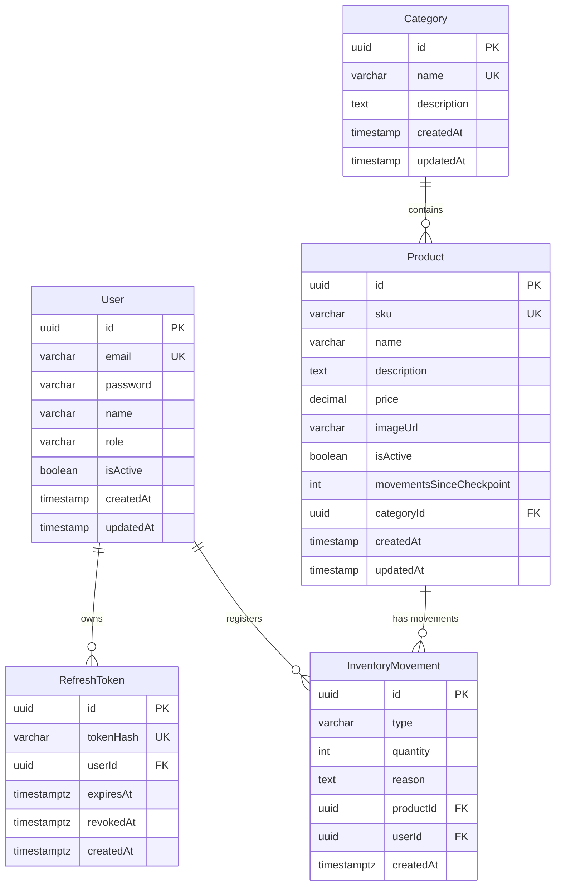
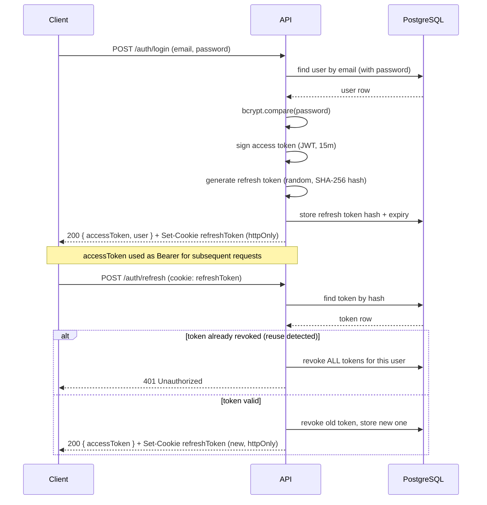
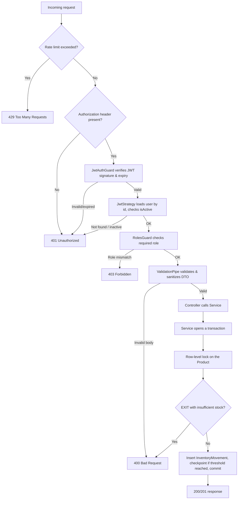

# Stockly

RESTful API for inventory management with role-based access control, custom JWT authentication (access token + rotating httpOnly refresh token), Redis-backed caching and rate limiting, and full movement-tracking history — built with NestJS on top of TypeORM (see [Engineering Highlights](#engineering-highlights)).

## Features

- User registration and login with hashed passwords (bcrypt, 12 salt rounds)
- Authentication via short-lived JWT access tokens + a rotating refresh token delivered as an httpOnly cookie
- Refresh token rotation with reuse detection: reusing an already-rotated token revokes every active session for that user (stolen-token mitigation)
- Role-based access control (ADMIN / USER) enforced with guards, plus per-resource identity checks (a user can view/edit their own profile; only the owner can change their own password)
- Full CRUD for products and categories, with soft-delete on products and delete-blocking on categories that still have associated products
- Product filtering by name/SKU (partial match), category, and price range, with paginated, deterministically-ordered results, backed by composite and trigram (GIN) indexes
- Inventory movements (ENTRY / EXIT / ADJUSTMENT) with full paginated history, computed stock derived from the movement log with an automatic checkpointing mechanism (not stored redundantly on the product), and row-level locking to prevent race conditions on concurrent stock updates
- Redis-backed response caching for `/products` and `/categories`, with write-side invalidation
- Redis-backed rate limiting: a global per-IP limit plus stricter limits on `/auth/login` and `/auth/register`
- Configurable database connection pool, tuned for concurrent load instead of relying on the driver's default
- Centralized error handling with a consistent response shape across the whole API
- Interactive API documentation via Swagger, with JWT bearer auth support
- Security headers via Helmet, strict CORS with credentials support, and request size limits
- Fail-fast environment variable validation at boot
- Fully containerized with a multi-stage Dockerfile (non-root runtime user) and Docker Compose orchestration (API + PostgreSQL + Redis)

## Stack

- Runtime: Node.js + NestJS (ES Modules)
- Database: PostgreSQL + TypeORM (versioned migrations, no `synchronize`)
- Caching & rate limiting: Redis (`ioredis`) — response caching for `/products`/`/categories`, and a custom `ThrottlerStorage` implementation backing `@nestjs/throttler`
- Authentication: JWT (`@nestjs/jwt`, `passport-jwt`) + bcrypt
- Validation: `class-validator` / `class-transformer`
- Documentation: Swagger (`@nestjs/swagger`)
- Security: Helmet, CORS, cookie-parser, rate limiting
- Testing: Vitest — unit tests (mocked repositories), end-to-end tests (real Postgres + Redis instances), and an isolated e2e suite for rate-limit behavior (own process, own environment)
- Containerization: Docker (multi-stage build) + Docker Compose

## Architecture

Modular, layered architecture: controllers → services → repositories (TypeORM), with cross-cutting concerns (auth guards, roles, exception handling, pagination, rate limiting) factored into a shared `common/` module. Configuration is centralized and validated once at boot, rather than read ad hoc from `process.env` throughout the codebase.

```
stockly/
├── src/
│   ├── config/
│   │   ├── env.ts                 # Fail-fast environment variable validation (db, jwt, redis, rate limit)
│   │   ├── typeorm.config.ts      # TypeORM options for runtime (AppModule), incl. connection pool sizing
│   │   ├── data-source.ts         # DataSource for the migrations CLI (dev/test), incl. connection pool sizing
│   │   └── data-source.prod.ts    # DataSource for the migrations CLI (prod)
│   │
│   ├── common/
│   │   ├── decorators/            # @Roles, @CurrentUser
│   │   ├── guards/                # JwtAuthGuard, RolesGuard
│   │   ├── filters/                # Global HttpExceptionFilter
│   │   ├── dto/                    # PaginationQueryDto
│   │   ├── enums/                  # Role
│   │   ├── utils/                  # Postgres error translation (unique/FK violations)
│   │   └── rate-limit/             # RateLimitModule, RedisThrottlerStorage (custom ThrottlerStorage over ioredis)
│   │
│   ├── redis/
│   │   ├── redis.module.ts         # Global module exposing the ioredis client via DI
│   │   └── redis.constants.ts      # REDIS_CLIENT injection token
│   │
│   ├── auth/
│   │   ├── entities/               # RefreshToken
│   │   ├── strategies/             # JwtStrategy
│   │   ├── dto/                    # RegisterDto, LoginDto
│   │   ├── auth.service.ts
│   │   └── auth.controller.ts      # login/register carry endpoint-specific rate limits
│   │
│   ├── users/
│   ├── categories/                 # findAll/findOne cached in Redis, invalidated on write
│   ├── products/                   # findAll cached in Redis via a version counter (see Engineering Highlights)
│   └── inventory/
│       # Each domain module follows the same shape:
│       # entities/, dto/, <module>.service.ts, <module>.controller.ts,
│       # plus *.spec.ts (unit) and *.e2e-spec.ts (end-to-end) alongside the code
│
├── test/
│   └── utils/
│       └── test-app.ts             # Shared e2e bootstrap (test app + DB/Redis cleanup + auth helpers)
│
├── frontend/                        # Vanilla JS + Vite SPA — see "Frontend" below for full details
│
├── public/                          # Frontend production build output (served by NestJS at /app)
│
├── Dockerfile                       # Multi-stage build (deps-prod / builder / runtime)
├── docker-compose.yml                # api + postgres + redis + postgres-test (test profile, opt-in)
├── vitest.config.ts                  # Unit tests
├── vitest.config.e2e.ts               # End-to-end tests (sequential execution against real DB + Redis)
├── vitest.config.rate-limit.e2e.ts    # Isolated e2e suite for rate-limit (own process, real low limits)
└── package.json
```

## Database Schema



### Indexes

Added as part of the performance audit (see [Engineering Highlights](#engineering-highlights)) to support the actual query patterns of the API rather than relying on sequential scans:

| Table                 | Index                                                             | Supports                                                                                      |
| --------------------- | ----------------------------------------------------------------- | --------------------------------------------------------------------------------------------- |
| `products`            | `(isActive, categoryId)`                                          | The `isActive = true` filter present in every listing query, combined with category filtering |
| `products`            | `(isActive, price)`                                               | Price range filtering (`minPrice`/`maxPrice`)                                                 |
| `products`            | GIN trigram on `name` (`pg_trgm`)                                 | `ILIKE '%text%'` substring search on product name                                             |
| `products`            | GIN trigram on `sku` (`pg_trgm`)                                  | `ILIKE '%text%'` substring search on SKU                                                      |
| `inventory_movements` | `(productId, createdAt DESC)`                                     | Movement history lookups and stock computation                                                |
| `inventory_movements` | `(productId, createdAt DESC) WHERE type = 'ADJUSTMENT'` (partial) | Finding the most recent checkpoint for a product, without scanning ENTRY/EXIT rows            |
| `inventory_movements` | `(createdAt DESC)`                                                | The recent-activity feed across all products                                                  |

## Authentication

- **Access token**: JWT signed with `JWT_ACCESS_SECRET`, short TTL (default 15 minutes), payload `{ sub, email, role }`. Returned in the response body and expected on the `Authorization: Bearer <token>` header for protected routes.
- **Refresh token**: an opaque random token (not a JWT), hashed with SHA-256 before being persisted. Delivered as an **httpOnly cookie** (`secure` in production, `sameSite: strict`) — never exposed to client-side JavaScript, and never included in any JSON response.
- **Rotation**: every call to `POST /auth/refresh` revokes the token just used and issues a brand-new pair. The same refresh token can never be redeemed twice.
- **Reuse detection**: if a token that has already been rotated (and is therefore revoked) is presented again, this is treated as a signal of token theft — every refresh token belonging to that user is immediately revoked, forcing re-authentication everywhere.
- Login rejects deactivated accounts (`isActive: false`) with the same generic `401` used for wrong credentials, so failed attempts never leak which emails are registered or which accounts are disabled.
- `POST /auth/logout` revokes the current refresh token and clears the cookie.
- `POST /auth/login` and `POST /auth/register` carry their own stricter rate limits (see [Security](#security)) on top of the global one.

## Authorization

Role-based access control (`ADMIN` / `USER`) via `JwtAuthGuard` + `RolesGuard`, with per-resource logic where a role alone isn't enough:

| Resource                      | Read                       | Write                                      |
| ----------------------------- | -------------------------- | ------------------------------------------ |
| Categories                    | Public                     | ADMIN only                                 |
| Products                      | Public                     | ADMIN only                                 |
| Inventory (movements & stock) | ADMIN only                 | ADMIN only                                 |
| Users (list)                  | ADMIN only                 | —                                          |
| Users (single profile)        | ADMIN or the user themself | ADMIN or the user themself                 |
| User password                 | —                          | The user themself only (not even an ADMIN) |

The user who registers an inventory movement is taken from the authenticated request (`@CurrentUser()`), never from the request body.

## Request Flow

**Authentication flow** — how a client obtains and renews access:



**Protected request flow** — how a request to an ADMIN-only endpoint is resolved (e.g. `POST /inventory/movements`):



## Installation

```bash
git clone <repo-url>
cd stockly
npm install
cp .env.example .env
```

Fill in `.env`:

```
DB_HOST=localhost
DB_PORT=5432
DB_USER=inventory_user
DB_PASSWORD=inventory_pass
DB_NAME=inventory_db
# DB_POOL_MAX=20
# DB_POOL_MIN=5
# DB_POOL_IDLE_TIMEOUT_MS=30000
# DB_POOL_CONNECTION_TIMEOUT_MS=5000

JWT_ACCESS_SECRET=
JWT_REFRESH_SECRET=
# JWT_ACCESS_EXPIRES_IN=15m
# JWT_REFRESH_EXPIRES_IN=7d

REDIS_URL=redis://localhost:6379
# RATE_LIMIT_GLOBAL_LIMIT=100
# RATE_LIMIT_GLOBAL_TTL_MS=60000
# RATE_LIMIT_LOGIN_LIMIT=5
# RATE_LIMIT_LOGIN_TTL_MS=60000
# RATE_LIMIT_REGISTER_LIMIT=3
# RATE_LIMIT_REGISTER_TTL_MS=3600000
```

Generate strong, distinct secrets for each JWT variable:

```bash
node -e "console.log(require('crypto').randomBytes(32).toString('hex'))"
```

> `JWT_ACCESS_SECRET` and `JWT_REFRESH_SECRET` must be different values — sharing a secret between the two token types would let a leaked refresh token be used to forge access tokens.

## Usage

### With Docker (recommended)

```bash
docker compose up -d
npm run migration:run
```

The API starts on `http://localhost:3000`. Swagger docs are available at `/api/docs` in non-production environments.

### Without Docker

Start local PostgreSQL and Redis instances matching your `.env`, then:

```bash
npm run migration:run
npm run start:dev
```

Verify it's running:

```bash
curl http://localhost:3000/categories
```

Expected response: `[]` (or an array of existing categories).

## Testing

```bash
npm run test                  # unit tests (mocked repositories + mocked Redis client)
npm run test:e2e              # end-to-end tests (requires the test database and Redis — see docker-compose.yml)
npm run test:e2e:rate-limit   # isolated e2e suite verifying real 429 behavior (own process, own env)
```

The main e2e suite runs with deliberately high rate limits (configured via environment) so that repeated logins/registrations across many test cases don't trip the throttler — the rate-limit suite runs in its own Vitest process with the real, low production limits, specifically to verify the `429` behavior end-to-end.

134 tests total: unit tests covering service logic (including transaction and pessimistic-lock behavior on inventory movements, and Redis cache hit/miss/invalidation, all mocked) and end-to-end tests exercising the full HTTP stack against real PostgreSQL and Redis instances — covering CRUD, filtering, pagination, caching, rate limiting, the complete authentication flow (including refresh-token rotation and reuse detection), and the full authorization matrix (public vs. ADMIN-only vs. self-or-ADMIN).

## API Documentation

Full interactive documentation (request/response schemas, example payloads, and a live "Try it out" console) is served via Swagger at `/api/docs` when the API is running outside of production. Every protected endpoint is marked with a bearer-auth lock icon — log in through `POST /auth/login` from the docs UI, then use the "Authorize" button with the returned access token to exercise the rest of the API interactively.

### Endpoints overview

#### Auth

| Method | Route          | Description                                             | Auth required              | Rate limit        |
| ------ | -------------- | ------------------------------------------------------- | -------------------------- | ----------------- |
| POST   | /auth/register | Registers a new user                                    | No                         | 3 / hour per IP   |
| POST   | /auth/login    | Authenticates a user, sets the refresh token cookie     | No                         | 5 / minute per IP |
| POST   | /auth/refresh  | Rotates the refresh token and issues a new access token | No (valid cookie required) | Global limit only |
| POST   | /auth/logout   | Revokes the current refresh token                       | No (valid cookie required) | Global limit only |
| GET    | /auth/me       | Returns the currently authenticated user                | Bearer token               | Global limit only |

#### Categories

| Method | Route           | Description                                                            | Auth required |
| ------ | --------------- | ---------------------------------------------------------------------- | ------------- |
| GET    | /categories     | Lists all categories (Redis-cached)                                    | No            |
| GET    | /categories/:id | Gets a category by id (Redis-cached)                                   | No            |
| POST   | /categories     | Creates a category, invalidates the cache                              | ADMIN         |
| PATCH  | /categories/:id | Updates a category, invalidates the cache                              | ADMIN         |
| DELETE | /categories/:id | Deletes a category (blocked if it has products), invalidates the cache | ADMIN         |

#### Products

| Method | Route         | Description                                                                                                                    | Auth required |
| ------ | ------------- | ------------------------------------------------------------------------------------------------------------------------------ | ------------- |
| GET    | /products     | Lists active products (Redis-cached per filter set) — supports `search`, `categoryId`, `minPrice`, `maxPrice`, `page`, `limit` | No            |
| GET    | /products/:id | Gets a product by id, with its category                                                                                        | No            |
| POST   | /products     | Creates a product, bumps the products cache version                                                                            | ADMIN         |
| PATCH  | /products/:id | Updates a product, bumps the products cache version                                                                            | ADMIN         |
| DELETE | /products/:id | Soft-deletes a product, bumps the products cache version                                                                       | ADMIN         |

#### Inventory

| Method | Route                                    | Description                                                                                                       | Auth required |
| ------ | ---------------------------------------- | ----------------------------------------------------------------------------------------------------------------- | ------------- |
| POST   | /inventory/movements                     | Registers an ENTRY, EXIT, or ADJUSTMENT movement (auto-checkpoints when due)                                      | ADMIN         |
| GET    | /inventory/products/:productId/stock     | Returns the current computed stock — `{ productId, stock }`                                                       | ADMIN         |
| GET    | /inventory/products/:productId/movements | Returns the paginated movement history, most recent first — `{ data, total, page, limit }`                        | ADMIN         |
| GET    | /inventory/movements/recent              | Returns the paginated recent activity feed across all products (max `limit`: 50) — `{ data, total, page, limit }` | ADMIN         |

#### Users

| Method | Route               | Description                      | Auth required |
| ------ | ------------------- | -------------------------------- | ------------- |
| GET    | /users              | Lists all users                  | ADMIN         |
| GET    | /users/:id          | Gets a user by id                | ADMIN or self |
| PATCH  | /users/:id          | Updates a user's profile         | ADMIN or self |
| PATCH  | /users/:id/password | Changes a user's password        | Self only     |
| DELETE | /users/:id          | Deactivates a user (soft-delete) | ADMIN         |

Common error codes:

| Code | Meaning                                                                           |
| ---- | --------------------------------------------------------------------------------- |
| 400  | Input validation error                                                            |
| 401  | Not authenticated (token/cookie missing, invalid, or expired)                     |
| 403  | Authenticated, but not authorized for this action                                 |
| 404  | Resource not found                                                                |
| 409  | Conflict (duplicate SKU/email/category name, or deleting a category still in use) |
| 429  | Rate limit exceeded                                                               |

## Security

- Passwords hashed with bcrypt (12 salt rounds)
- Access and refresh tokens signed/hashed with separate secrets — a compromised refresh token can't be used to forge an access token
- Refresh tokens are opaque, hashed at rest, rotated on every use, and revoked in bulk on reuse detection
- Refresh token delivered as an httpOnly cookie (`secure` in production, `sameSite: strict`) — inaccessible to client-side JavaScript
- CORS restricted with `credentials: true`, required for the cookie to work across origins
- Security headers via Helmet; `X-Powered-By` disabled
- Request body size limits (1MB) on JSON and URL-encoded payloads
- Sensitive data (`password`) never included in API responses, enforced at the entity level (`select: false`) as well as explicitly stripped in auth responses
- Every write to `users` password/profile endpoints is scoped to the authenticated user's identity at the controller level, not only relying on the route parameter
- **Access token kept in memory on the client (never `localStorage`/`sessionStorage`)**, so it can't be exfiltrated via XSS reading persistent storage
- Redis-backed rate limiting: a 100 req/min global limit per IP, plus dedicated stricter limits on `/auth/login` (5/min) and `/auth/register` (3/hour) to mitigate credential-stuffing and mass account creation
- Swagger UI is disabled in production
- Environment variables are validated at boot — the application fails fast with a clear error if a required variable is missing, instead of failing unpredictably later

## Engineering Highlights

This project went through a dedicated backend performance audit targeting ~1,000 concurrent users and a 5,000-product catalog. Beyond the fixes themselves, each one below includes the reasoning and, where relevant, the wrong turn taken first — the kind of detail that matters more than the diff itself.

- **Query-shaped indexing, not guesswork.** Rather than indexing every column, indexes were chosen to match actual access patterns: a composite `(isActive, categoryId)` index because `isActive = true` is present in _every_ product listing query; a partial index on `inventory_movements` scoped to `WHERE type = 'ADJUSTMENT'`, since checkpoint lookups only ever care about that subset of rows; GIN trigram indexes so `ILIKE '%text%'` substring search — which a normal B-tree index can't support — stops forcing a sequential scan.
- **A caching strategy chosen for the shape of the data, not copy-pasted.** `/categories` (small, low-churn) is cached under one key with direct invalidation. `/products` accepts arbitrary filter/pagination combinations, so there's no fixed key to invalidate — pattern-based scanning (`SCAN`/`KEYS`) doesn't hold up under real load, so cache keys instead embed a version counter that a single `INCR` orphans on any write, letting stale entries expire naturally via TTL instead of being tracked down individually.
- **A self-correcting bottleneck, not just a faster query.** Computed stock summed a product's _entire_ movement history on every read, while holding a row lock during writes — a query that got slower over the system's own lifetime. The fix (an automatic checkpoint every 50 movements) bounds that cost permanently, independent of how long the system has been running.
- **The failed attempt is part of the story.** A single windowed query (`COUNT(*) OVER()`) looked like a clean way to merge a count and a paginated result into one round-trip — until the existing e2e pagination tests caught that TypeORM silently scopes the window function to the page size, not the full result set, once a join and `skip`/`take` combine. The existing test suite caught a real correctness bug before it shipped, and the eventual fix (two lean, explicit queries) is what actually ended up in the codebase.
- **Dependency reality checked before installing.** The two community Redis storage adapters for `@nestjs/throttler` didn't yet declare support for the NestJS 12 already in use. Rather than forcing an install with `--legacy-peer-deps` against a third-party package of uncertain maintenance, the `ThrottlerStorage` interface was implemented directly against the `ioredis` client already in the project — a small, stable interface, backed by a single atomic Lua script (`INCR` + `PEXPIRE` in one round-trip, closing the race window two separate commands would leave open under real concurrency).
- **Rate limiting that doesn't fight its own test suite.** Auth endpoints needed both a real, low rate limit in production and a test suite that logs in dozens of times per file without tripping it. Rather than weakening the limit, environment-aware defaults keep it high during the main e2e run, while a single dedicated test file boots in its own Vitest process with real limits restored — verifying the actual `429` response instead of leaving rate limiting as the one thing in the system with no test coverage.

---

# Frontend

A vanilla JS + Vite single-page app (no framework) that consumes the Stockly API. It lives in `frontend/` as source, builds to `public/`, and is served by the API itself through `ServeStaticModule` at `/app`. Because both the API and the frontend are served from the same host and port in production (only the path differs), the httpOnly refresh cookie travels freely without CORS in that environment. In development, Vite runs on its own port and proxies API routes back to `http://localhost:3000` via `server.proxy`.

## Authentication pattern

The frontend applies the exact same token model the backend already documents:

- **Access token in memory only.** It lives in a module-scoped variable (`auth-store.js`) and is lost on reload. It is never written to `localStorage` or `sessionStorage`, so an XSS payload can't exfiltrate it by reading persistent storage.
- **Refresh token untouched by JS.** The httpOnly cookie is sent automatically by the browser on every `/auth/*` request (`credentials: 'include'`), but the frontend code never reads or manipulates it.
- **Silent refresh at boot.** On startup, `silentRefresh()` attempts `POST /auth/refresh` before deciding which screen to show. If the cookie is valid, the user goes straight to the app shell; otherwise the login screen appears. A `body.app-loading` class hides both screens during this window so the login form doesn't flash for users who already had a session.
- **Automatic refresh on 401 with concurrency collapse.** When a request fails with an expired access token, `api.js` fires a single `POST /auth/refresh` shared across all concurrent requests that failed, then retries the original request once. Without this coordination, simultaneous 401s (e.g. dashboard loading three resources at once) would trigger parallel refreshes — which, given the backend's refresh-token rotation with reuse detection, would revoke all of the user's sessions. A module-level promise (`refreshPromise`) ensures the refresh happens once.
- **Logout always clears local state.** `logout()` calls the backend to revoke the refresh token, then clears the in-memory store in a `finally` block, so the client-side session is gone even if the network call fails.

## `GET /auth/me` — endpoint added to support boot

Bootstrapping the frontend needs the current user's full profile, not just the JWT payload. Rather than decoding the token in the client and issuing a second request to `GET /users/:id`, a dedicated `GET /auth/me` endpoint was added. It returns the authenticated user (with `password` stripped) using the same JWT validation as every other protected route. This keeps the frontend decoupled from the token's internal shape and makes `login` and `silentRefresh` symmetric: both end with a single `setSession(accessToken, user)` call.

## Structure

```
frontend/
├── index.html                    # Single page, two screens toggled via CSS (.hidden)
├── vite.config.js                # API proxy + outDir to ../public
└── src/
    ├── main.js                   # Bootstrap: silentRefresh, screen switch, route registration, router start
    ├── router.js                 # Hash-based router, no library
    ├── style.css                 # CSS variables + reset + reusable components
    ├── services/                 # API communication layer
    │   ├── auth-store.js         # In-memory state: accessToken + current user
    │   ├── api.js                # Central fetch: bearer, credentials, 401 refresh, ApiError
    │   ├── auth.service.js       # login, register, logout, silentRefresh
    │   ├── categories.service.js
    │   ├── products.service.js
    │   ├── inventory.service.js  # registerMovement, getStock, getHistory, getRecentMovements (all paginated)
    │   └── users.service.js
    └── views/                    # One render(root) function per route
        ├── auth.view.js          # Login/register toggle + handlers
        ├── dashboard.view.js     # Counts + recent activity feed (reads response.data from paginated endpoints)
        ├── inventory.view.js     # Product search, movement form, paginated history (reads response.data)
        └── ...                   # products, categories, users, profile
```

## Routes

Hash-based, client-side only (no server routing beyond serving `index.html`):

| Route          | View                 | Access                            |
| -------------- | -------------------- | --------------------------------- |
| `#/dashboard`  | `dashboard.view.js`  | Any authenticated user            |
| `#/products`   | `products.view.js`   | Any authenticated user            |
| `#/categories` | `categories.view.js` | Any authenticated user            |
| `#/inventory`  | `inventory.view.js`  | ADMIN only (link hidden for USER) |
| `#/users`      | `users.view.js`      | ADMIN only (link hidden for USER) |
| `#/profile`    | `profile.view.js`    | Any authenticated user            |

`isAdmin()` is re-evaluated on every navigation (not cached at boot), so logging out and back in as a different role updates the sidebar and available routes immediately.

## Consuming paginated endpoints

Every list endpoint in the API (`/products`, and, as of the performance audit, the inventory history/recent-activity endpoints) returns `{ data, total, page, limit }` rather than a bare array. Every view that renders one of these lists reads `.data` explicitly — this is a real contract the frontend depends on, not an implementation detail: a service method that used to resolve to `Movement[]` now resolves to `{ data: Movement[], total, page, limit }`, and every call site was updated accordingly (`dashboard.view.js`'s activity feed and `inventory.view.js`'s history table, both consuming `inventory.service.js`).

## Installation & development

```bash
cd frontend
npm install
npm run dev       # Vite dev server with API proxy to localhost:3000
npm run build     # Outputs to ../public, served by the API in production
```

For the full build-out checklist (13 phases, from Vite setup through final polish, including every real bug hit and fixed along the way), see [`FRONTEND.md`](./FRONTEND.MD).
